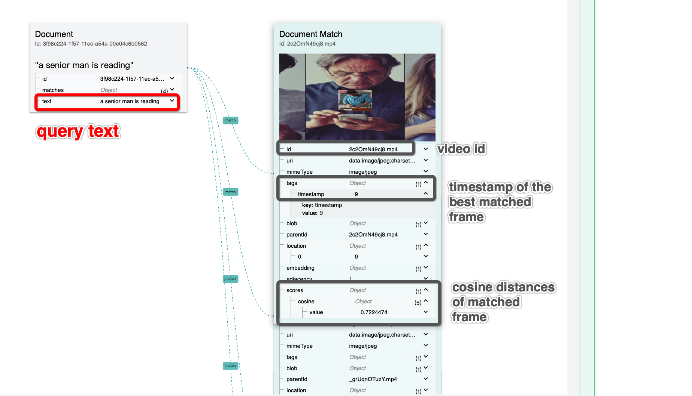

# Build A Video Search System using jina

**Table of Contents**
- [Overview](#overview)
- [🐍 Build the app with Python](#-build-the-app-with-python)
- [🔮 Overview of the files in this example](#-overview-of-the-files-in-this-example)
- [🌀 Flow diagram](#-flow-diagram)
- [🔨 Next steps, building your own app](#-next-steps-building-your-own-app)
- [🐳 Deploy the prebuild application using Docker](#-deploy-the-prebuild-application-using-docker)
- [🙍 Community](#-community)
- [🦄 License](#-license)


## Overview
| About this example: |  |
| ------------- | ------------- |
| Learnings | How to search through both image frames and audio of a video. |
| Used for indexing | Video Files. |
| Used for querying | Text Query (e.g. "girl studying engineering") |
| Dataset used | Choose your own videos |
| Model used | [AudioCLIP](https://github.com/AndreyGuzhov/AudioCLIP) |

In this example, Jina is used to implement a video search system.
Videos can be indexed and afterwards searched by text inputs. 
Jina searches both the image frames and the audio of the video and returns
the matched video and a timestamp.

_____

## 🐍 Build the app with Python

These instructions explain how to build the example yourself and deploy it with Python.


### 🗝️ Requirements

1. You have a working Python 3.7 or 3.8 environment and a installation of [Docker](https://docs.docker.com/get-docker/), assure that you set enough memory resources(more than 6GB) to the docker. You can set it in settings/resources/advanced in your Docker.
2. We recommend creating a [new Python virtual environment](https://docs.python.org/3/tutorial/venv.html) to have a clean installation of Jina and prevent dependency conflicts.   
3. You have at least 5 GB of free space on your hard drive. 

### 👾 Step 1. Clone the repo and install Jina

Begin by cloning the repo, so you can get the required files and datasets. (If you already have the examples repository on your machine make sure to fetch the most recent version)

```sh
git clone https://github.com/jina-ai/example-video-search
cd example-video-search
````
In your terminal, you should now be located in the *example-video-search* folder. Let's install Jina and the other required Python libraries. For further information on installing Jina check out [our documentation](https://docs.jina.ai/chapters/core/setup/).

```sh
pip install -r requirements.txt
```

### Step 2. Download the AudioCLIP model.
We recommend you to download the AudioCLIP model in advance.
To do that, run:
```bash
bash scripts/download_model.sh
```

### 🏃 Step 3. Index your data
To quickly get started, you can index a [small dataset](toy-data) to make sure everything is working correctly. 

To index the toy dataset, run
```bash
python app.py -m grpc
```
After indexing, the search flow is started automatically and three simple test queries are performed.
The results are displayed in your terminal.

We recommend you come back to this step later and index more data.

Alternatively, you can use the restful indexing:
```bash
python app.py -m restful
```

### 🔎 Step 4: Query your data
After indexing once, you can query without indexing by running

```bash
python app.py -m restful_query
```

Afterwards, you can query with

```bash
curl -X 'POST' 'localhost:45678/search' \
-H 'accept: application/json' \
-H 'Content-Type: application/json' \
-d '{"data": [{"text": "this is a highway"}]}'
```

The retrieved results contains the video filename (id) and the best matched frame in that video together with its 
timestamp.



You can also add more parameters to the query:
```sh
curl -X POST -d '{"parameters":{"top_k": 5}, "data": ["a black dog and a spotted dog are fighting"]}' -H 'accept: application/json' -H 'Content-Type: application/json' 'http://localhost:45678/search'
```

Once you run this command, you should see a JSON output returned to you. This contains the five most semantically similar images sentences to the text input you provided in the `data` parameter.
Note, that the toy-data only contains one video.
Feel free to alter the text in the 'data' parameter and play around with other queries (this is only fun with a large dataset)! For a better understanding of the parameters see the table below. 

|                      |                                                                                                                  |
| -------------------- | ---------------------------------------------------------------------------------------------------------------- |
| `top_k` | Integer determining the number of matches to return |
| `data` | Text input to query |

## 📉 Understanding your results
When searching by text, the Flow returns the search document with matches appended to it.
These matches will contain a video URI and a timestamp.

## 🌀 Flow diagram
This diagram provides a visual representation of the Flows in this example; Showing which executors are used in which order.
Remember, our goal is to compare vectors representing the semantics of images and audio with vectors encoding the semantics of short text descriptions.

### Indexing
  
As you can see, the Flow that Indexes the data contains two parallel branches: 
- Image: Encodes image frames from the video and indexes them.
- Audio: Encodes audio of the images and indexes it.

### Querying
  
The query flow is different to the index flow. We are encoding the text input using the AudioCLIP model and then
compare the embeddings with the audio and image embeddings we have stored in the indexers.
Then, the indexers add the closest matches to the documents.

## 🔮 Overview of the files

|                      |                                                                                                                  |
| -------------------- | ---------------------------------------------------------------------------------------------------------------- |
| 📃 `index-flow.yml`  | YAML file to configure indexing Flow |
| 📃 `search-flow.yml` | YAML file to configure querying Flow |
| 📃 `executors.py`    | File that contains Ranker and ModalityFilter executors  |
| 📂 `workspace/`      | Folder to store indexed files (embeddings and documents). Automatically created after the first indexing   |
| 📂 `toy-data/`       | Folder to store the toy dataset for the example  |
| 📃 `app.py`          | Main file that runs the example  |


## ⏭️ Next steps

Did you like this example and are you interested in building your own? For a detailed tutorial on how to build your Jina app check out [How to Build Your First Jina App](https://docs.jina.ai/chapters/my_first_jina_app/#how-to-build-your-first-jina-app) guide in our documentation.  

To learn more about Jina concepts, check out the [cookbooks](https://github.com/jina-ai/jina/tree/master/.github/2.0/cookbooks).  

If you have any issues following this guide, you can always get support from our [Slack community](https://slack.jina.ai) .

## 👩‍👩‍👧‍👦 Community

- [Slack channel](https://slack.jina.ai) - a communication platform for developers to discuss Jina.
- [LinkedIn](https://www.linkedin.com/company/jinaai/) - get to know Jina AI as a company and find job opportunities.
- [](https://twitter.com/JinaAI_) - follow us and interact with us using hashtag `#JinaSearch`.  
- [Company](https://jina.ai) - know more about our company, we are fully committed to open-source!

## 🦄 License

Copyright (c) 2021 Jina AI Limited. All rights reserved.

Jina is licensed under the Apache License, Version 2.0. See [LICENSE](https://github.com/jina-ai/jina/blob/master/LICENSE) for the full license text.
